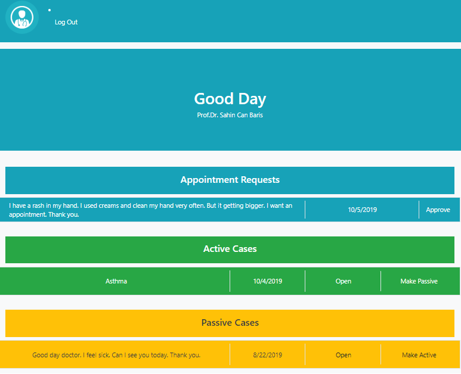
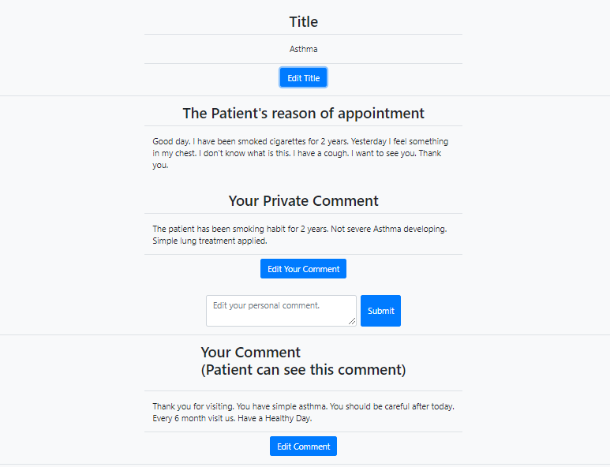

# Patient-Doctor Communication Subsystem

Health is most important think in human life. Money, happeness, productivity short of all everything depends on your Healty life. The job of the doctors do is divine.

Losing health is most scared situation in human life. Before that, Humans can feel some symptoms. And go to doctors. They need appointment, communicate doctor, take their medication list etc. And   **Patient-Doctor Communication Subsystem** here to help patients!

This subsystem start simle sign up. The page take some information about patient. Such as, Date of Birth, Email, Name, Gender. 

After sign up you directly going to Patient Page.

This is simple page to Get an Appointment, Log Out and see Hospital Location. If the patient want to see doctor, They click New Appointment and can get an appointment.

There are 2 section in the appointment page. First one is date of appointment and reason of appointment. 
These information create new case. This case associate to patient. And shown as un approved.
Date of appointment section has limitation for proper date. The patient cannot request any appointment day before today.
Un approved appointment requests shown as "Appointment Requests" on patient page. Patient can remove these requests.

After doctor aprove this appoinment request this case sended to "Your Approved Appointments" section. Patient can open the case.

In case page, Patients can see some information about their sickness. 

If patients want to send message to associated doctor, they also can see a message box under the information. They can send a message to doctor. 

If the doctor log in, The page directly send to client to "Doctor Page". Doctor only sign in with operator permission. Database mannager or admin will add doctor to database.

Doctor can see appointment requests, active cases and passive cases. 
Appointment Request means un approved request. Doctor can aprove it. After doctor approvance this case associate to doctor and sended to active cases section.
If doctor still working in one case this case shown as active, or doctor can change this activity to passive.

Doctor can open every approved cases. 

Doctor can change Title, comment and medication sections.

Also Doctor can add private comment. This comments section only seen by doctors. 

If doctor want to send any message to associated patient, There is a message box below of the information. 

After doctor or patient send message, this message added to case collection. Also this message sended to other sides' e-mail adress as notification. 

--------------------------

This Project is 3. Project of the Coding Boot Camp.

Designed to be part of a hospital page. 
Inspired from problems comes from lack of communication between Doctors and Patients.

MERN Project.

React-JS : With advanced OOP technique. Controller, routes and middlewares used. Components and pages used clearly.

Mongo-Mongoose : Models designed well. Collections associated each other with functions. 

NodeMailler : external Node package. Used for determine mail adressed and sended mails.

Axios - Express : Post - Get - Delete - Create functions from pages and components.

Json Web Token : Securing patient informations and signin authentication.

bcryptjs : User authentication and bcrypt user password in database.

Thank you.

